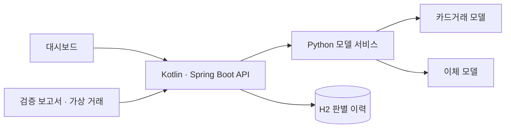

# Fraud Lab

카드거래와 전자금융공동망 이체의 이상징후 탐지 모델을 Kotlin·Spring Boot 대시보드에 연결한 프로젝트입니다. 저장소를 복제하면 학습된 모델 2개, 검증 보고서, 가상 거래 시나리오로 화면과 재판별 기능을 실행할 수 있습니다. 원본 데이터 다운로드는 실행에 필요하지 않습니다.

모델 학습과 검증에는 AI Hub [「이상 판별을 위한 금융거래 정보 및 사용자 패턴 합성데이터」](https://aihub.or.kr/aihubdata/data/view.do?dataSetSn=71925)의 카드거래·전자금융공동망 CSV를 사용했습니다. [AI Hub 이용정책](https://www.aihub.or.kr/intrcn/guid/usagepolicy.do?currMenu=151&topMenu=105)과 [FAQ](https://www.aihub.or.kr/aihubnews/faq/list.do)에 따라 원본 CSV와 원본 행을 가공한 샘플은 배포하지 않습니다. 공개된 거래 시나리오는 이 프로젝트에서 별도로 만들었습니다.

## 처리 흐름

대시보드는 Kotlin API를 거쳐 Python 모델 서비스에 점수를 요청합니다. 이체 판별 결과는 H2에 저장되고, 검증 보고서와 가상 거래 시나리오는 저장소에 포함된 파일에서 읽습니다.



## 현재 결과

| 평가 대상 | PR-AUC | 경보 정밀도 | 이상거래 재현율 | 경보 비율 |
| --- | ---: | ---: | ---: | ---: |
| 2024년 카드거래 검증 52,396건 | 0.989 | 99.84% | 34.97% | 1.20% |
| 2024년 전자금융공동망 검증 159,380건 | 0.488 | 44.45% | 81.24% | 0.83% |


2023년 3분기까지의 학습 데이터 1,208,562건 중 193,528건을 고정 시드로 추출해 모델을 학습했습니다. 경보 기준은 2023년 4분기 학습 데이터 109,817건에서 정하고, 2024년 검증 데이터에 한 번 적용했습니다. 검증 결과는 정탐지 628건, 오탐지 1건, 미탐지 1,168건입니다. 지표와 파일별 결과는 `reports/`에 저장됩니다.

전자금융공동망 모델은 2023년 3분기까지의 학습 데이터에서 382,040건을 추출해 학습하고, 2023년 4분기 학습 데이터로 경보 기준을 정했습니다. 2024년 검증에서 정탐지 589건, 오탐지 736건, 미탐지 136건이었습니다. 같은 기준 설정 방식으로 금액만 사용한 비교값의 PR-AUC는 0.445였습니다.

두 결과 모두 AI Hub 합성 데이터에서 얻은 실험 결과로, 실제 금융거래의 성능을 뜻하지 않습니다. 이체 모델의 분기별 PR-AUC는 0.442~0.610이었고, 입력 열을 섞어 보는 검사에서는 거래금액의 영향이 가장 컸습니다. 카드 모델의 일부 집계 열과 이체 모델의 자금·매체 구분 코드가 실제 거래 승인 시점에 제공되는지는 확인하지 못했습니다. 화면의 가상 거래에는 정답 라벨이 없으며, 검증 지표 계산에도 포함되지 않습니다.

## 구성

```text
data/                    본인이 AI Hub에서 승인받아 내려받은 CSV(배포 제외)
scripts/                 실행, 데이터 점검, 모델 학습·감사, 가상 거래 생성, 모델 HTTP 서비스
models/                  배포 가능한 카드거래·이체 모델(.skops)
reports/                 데이터 분포·평가 지표·가상 거래 시나리오
server/                  Kotlin·Spring Boot API, H2 판별 이력, 대시보드
```

코틀린 서버는 카드거래용 `GET /api/metrics`, `GET /api/demo`, `POST /api/score`와 이체용 `GET /api/bank/metrics`, `GET /api/bank/demo`, `POST /api/bank/score`를 제공합니다. `POST /api/bank/events`는 이체를 판별한 뒤 결과를 H2에 저장하며, `GET /api/bank/alerts`는 최근 경보를 반환합니다. `GET /api/bank/monitoring`은 최근 판별 데이터의 입력 분포 변화, 활동일별 판별 추이, 모델 버전별 경보 비율을 반환합니다. 점수 요청은 Python 모델 서비스로 전달하며 두 서버는 `127.0.0.1`에만 바인딩합니다.

`POST /api/bank/events`에 `Idempotency-Key`를 보내면 같은 키와 동일한 JSON 본문의 재시도는 저장된 결과를 HTTP 200으로 반환합니다. 첫 판별은 HTTP 201이며, 같은 키로 다른 본문을 보내면 HTTP 409를 반환합니다. 키가 없으면 기존처럼 매 요청을 새 판별로 저장합니다. 대시보드는 요청 실패 후 같은 입력을 다시 보낼 때 키를 재사용합니다.

이체 판별 요청이 [입력 계약](docs/bank-input-contract.md)을 어기면 HTTP 400을 반환합니다. 모델 서비스가 HTTP 200을 반환해도 점수·임계값·경보 여부·모델 버전이 유효하지 않으면 HTTP 502를 반환하고 판별 이력에 저장하지 않습니다.

이체 판별 이력에는 서버가 만든 이벤트 ID, 판별 시각, 네 입력값, 점수, 경보 여부, 임계값, 모델 파일의 SHA-256 기반 버전을 저장합니다. 계좌·금융회사 식별자는 요청 계약과 DB 스키마에서 제외했습니다. 로컬 DB는 `server/runtime/`에 생성되며 Git에 포함되지 않습니다. 모델 파일은 `joblib` 대신 허용할 타입을 고정한 `skops` 형식으로 배포합니다.

모니터링은 최근 판별 최대 1,000건을 학습 표본 382,040건의 집계 분포와 비교합니다. 같은 표본을 UTC 기준 최근 14개 활동일로 묶어 판별량과 경보 비율도 보여줍니다. 거래가 없었던 날짜는 추이에 포함하지 않습니다. 거래금액은 Population Stability Index(PSI), 시간대·자금구분·매체구분은 Total Variation Distance(TVD)를 사용합니다. 30건 미만에서는 변화 상태를 판정하지 않습니다. PSI는 0.10·0.25, TVD는 0.10·0.20을 관찰·변화 큼의 경계로 사용하지만, 운영 판단을 돕기 위한 기준값일 뿐 모델 성능이나 실제 이상거래 증가를 뜻하지 않습니다. 원본 학습 행은 포함하지 않고 집계 분포의 버전과 변경 사유를 `reports/bank_baseline.json`에 저장합니다. 기준이 바뀌면 이전 집계 분포도 같은 보고서에 보존하고 대시보드에서 이력을 조회할 수 있습니다.

이체 점수 API는 아래 네 필드만 받습니다. 금액과 시간대는 JSON 숫자, 구분 코드는 문자열입니다. 시간대는 원본 데이터에 존재하는 3시간 단위 코드 `0, 3, 6, 9, 12, 15, 18, 21` 중 하나여야 합니다. 학습된 자금구분 코드는 `0, 1, 3, 4`, 매체구분 코드는 `1`부터 `7`까지입니다. 알 수 없는 코드, 범위를 벗어난 시간대, 추가 필드는 HTTP 400을 반환합니다. 공식 코드의 의미와 현재 모델이 받는 범위는 [이체 판별 입력 계약](docs/bank-input-contract.md)에 정리했습니다.

```json
{"거래금액":5000000,"거래시간대":9,"자금구분":"0","매체구분":"2"}
```

## 실행

Python 3.14와 JDK 17이 필요합니다. 처음 실행할 때 Python 패키지와 Gradle 의존성 다운로드를 위해 인터넷 연결이 필요합니다. Windows PowerShell에서 다음 명령을 실행합니다.

```powershell
git clone https://github.com/sugowslt/transaction-anomaly-detection.git
cd transaction-anomaly-detection
python scripts\run_demo.py
```

`http://127.0.0.1:8080`에서 화면을 엽니다. 종료할 때는 실행한 터미널에서 `Ctrl+C`를 누릅니다. `run_demo.py`는 로컬 가상환경을 만들고 Python 모델 서비스와 Kotlin 서버를 실행합니다. 모델 서비스의 주소는 `http://127.0.0.1:8001`입니다.

포트가 이미 사용 중이면 `python scripts\run_demo.py --web-port 8081 --model-port 8002`처럼 바꿀 수 있습니다.

직접 프로세스를 나눠 실행하려면 가상환경 설치 후 터미널 두 개를 사용합니다.

```powershell
python -m venv .venv
.\.venv\Scripts\python.exe -m pip install -r requirements.txt
.\.venv\Scripts\python.exe scripts\serve_model.py
```

```powershell
cd server
.\gradlew.bat bootRun
```

모델 서비스가 꺼져 있어도 저장된 평가 지표와 기존 경보 이력은 볼 수 있지만, 거래 재판별에는 두 프로세스가 모두 필요합니다.

## 문제 해결 기록

실제 개발·실행 중 발생하고 원인을 확인한 문제는 [문제 해결 기록](docs/troubleshooting.md)에 증상·원인·해결·검증 순서로 정리합니다.

## 학습과 검증 재현

AI Hub에서 본인 계정으로 데이터 이용 신청·승인을 받은 뒤 카드거래와 전자금융공동망 CSV를 각각 `data/training/<분류>/`와 `data/validation/<분류>/`에 넣습니다. 원본 CSV는 Git에서 계속 제외합니다. 다음 명령은 기존 모델과 보고서를 다시 생성하므로 별도 브랜치에서 실행하는 편이 안전합니다.

```powershell
.\.venv\Scripts\python.exe scripts\train_card_baseline.py
.\.venv\Scripts\python.exe scripts\audit_card_baseline.py
.\.venv\Scripts\python.exe scripts\build_demo.py
.\.venv\Scripts\python.exe scripts\train_bank_baseline.py
.\.venv\Scripts\python.exe scripts\audit_bank_baseline.py
.\.venv\Scripts\python.exe scripts\build_bank_demo.py
```

기준 분포가 바뀌는 재학습에는 `train_bank_baseline.py --reference-change-reason "변경 사유"`를 사용합니다. 분포가 같으면 기존 버전과 이력을 유지합니다. `profile_dataset.py`는 필요할 때 로컬 데이터 분포 보고서를 다시 만들며, 결과 파일은 Git에 올리지 않습니다.

## 다음 작업

실제 거래 승인 흐름에서 네 입력값을 모두 받을 수 있는지는 금융 시스템의 요청 스키마로 확인해야 합니다.
