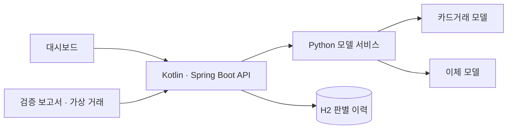
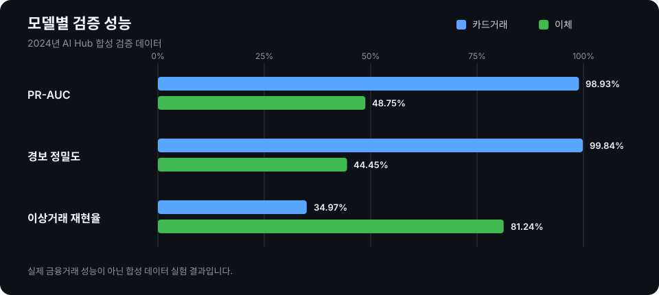

# Fraud Lab

카드거래와 전자금융공동망 이체의 이상징후를 탐지하는 모델과 Kotlin·Spring Boot 대시보드입니다. 저장소에 포함된 모델 2개와 가상 거래 시나리오로 결과를 살펴보고 거래 조건을 바꿔 다시 판별할 수 있습니다. 데모 실행에 원본 데이터는 필요하지 않습니다.

모델 학습과 검증에는 AI Hub [「이상 판별을 위한 금융거래 정보 및 사용자 패턴 합성데이터」](https://aihub.or.kr/aihubdata/data/view.do?dataSetSn=71925)의 카드거래·전자금융공동망 CSV를 사용했습니다. [AI Hub 이용정책](https://www.aihub.or.kr/intrcn/guid/usagepolicy.do?currMenu=151&topMenu=105)과 [FAQ](https://www.aihub.or.kr/aihubnews/faq/list.do)에 따라 원본 CSV와 원본 행을 가공한 샘플은 배포하지 않습니다. 데모 거래는 별도로 만든 가상 시나리오입니다.

## 주요 기능

- 카드거래와 이체 모델의 2024년 검증 결과를 그래프와 지표로 비교합니다.
- 가상 거래의 금액과 시간대를 바꿔 모델 점수를 다시 확인합니다.
- 이체 판별 결과를 저장하고 정상·경보 이력을 조회합니다. 가상 이체 32건으로 최근 입력 분포와 모델 버전별 경보 비율을 바로 살펴볼 수 있습니다.

## 처리 흐름

대시보드는 Kotlin API를 거쳐 Python 모델 서비스에 점수를 요청합니다. 이체 판별 결과는 H2에 저장되고, 검증 보고서와 가상 거래 시나리오는 저장소에 포함된 파일에서 읽습니다.



## 모델 평가

| 평가 대상 | PR-AUC | 경보 정밀도 | 이상거래 재현율 | 경보 비율 |
| --- | ---: | ---: | ---: | ---: |
| 2024년 카드거래 검증 52,396건 | 0.989 | 99.84% | 34.97% | 1.20% |
| 2024년 전자금융공동망 검증 159,380건 | 0.488 | 44.45% | 81.24% | 0.83% |



카드 모델은 2023년 3분기까지의 학습 데이터 1,208,562건 중 193,528건을 고정 시드로 추출해 학습했습니다. 경보 기준은 2023년 4분기 학습 데이터 109,817건에서 정하고 2024년 검증 데이터에 적용했습니다. 정탐지 628건, 오탐지 1건, 미탐지 1,168건이었습니다.

이체 모델은 2023년 3분기까지의 학습 데이터에서 382,040건을 추출해 학습하고, 2023년 4분기 학습 데이터로 경보 기준을 정했습니다. 2024년 검증에서 정탐지 589건, 오탐지 736건, 미탐지 136건이었습니다. 금액만 사용한 비교 모델의 PR-AUC는 0.445였습니다. 자세한 지표와 파일별 결과는 `reports/`에 있습니다.

두 결과 모두 합성 데이터에서 얻은 실험 결과이며 실제 금융거래 성능을 뜻하지 않습니다. 이체 모델의 분기별 PR-AUC는 0.442~0.610이었고, 카드 모델의 일부 집계 열과 이체 모델의 자금·매체 구분 코드가 실제 거래 승인 시점에 제공되는지는 확인하지 못했습니다. 화면의 가상 거래에는 정답 라벨이 없어 검증 지표에 포함하지 않았습니다.

## 경보 기준 비교

모델 점수는 같아도 경보 기준을 바꾸면 정밀도와 재현율이 달라집니다. [scikit-learn의 결정 임계값 안내](https://scikit-learn.org/1.9/modules/classification_threshold.html)에 따라 모델 학습에 쓰지 않은 2023년 4분기 학습 보류 구간의 점수로 기준을 정하고, 2024년 검증 데이터는 결과 비교에만 사용했습니다.

| 모델 | 기준을 정할 때 목표 경보량 | 2024년 검증 경보 비율 | 정밀도 | 재현율 | 오탐 |
| --- | ---: | ---: | ---: | ---: | ---: |
| 카드 | 1% · 현재 기준 | 1.20% | 99.84% | 34.97% | 1건 |
| 카드 | 2% | 2.35% | 99.76% | 68.43% | 3건 |
| 이체 | 1% · 현재 기준 | 0.83% | 44.45% | 81.24% | 736건 |
| 이체 | 2% | 1.76% | 25.82% | 100.00% | 2,083건 |

합성 데이터에서 경보량을 늘리면 카드 모델의 미탐지가 줄지만, 이체 모델의 오탐도 크게 늘어납니다. 운영 기준을 추천하는 결과는 아닙니다. 다른 경보량과 정확한 수치는 대시보드와 `reports/threshold_tradeoff.json`에서 확인할 수 있습니다.

## 구성

```text
data/                    AI Hub 승인 후 내려받은 CSV(배포 제외)
scripts/                 실행, 데이터 점검, 모델 학습·감사, 가상 거래 생성, 모델 HTTP 서비스
models/                  배포 가능한 카드거래·이체 모델(.skops)
reports/                 데이터 분포·평가 지표·가상 거래 시나리오
server/                  Kotlin·Spring Boot API, H2 판별 이력, 대시보드
```

이체 판별은 `POST /api/bank/events`가 Python 모델 서비스에 점수를 요청한 뒤 H2에 기록합니다. 같은 요청을 재시도할 때는 `Idempotency-Key`로 중복 저장을 막습니다. `GET /api/bank/decisions`는 전체·경보·정상 이력을 페이지 단위로 반환하고, `GET /api/bank/monitoring`은 최근 판별 최대 1,000건의 입력 분포와 활동일별 추이, 모델 버전별 경보 비율을 보여줍니다. 모니터링은 30건 미만에서 변화 상태를 판정하지 않습니다.

이체 기록에는 거래금액·시간대·자금구분·매체구분과 판별 결과를 저장합니다. 계좌·금융회사 식별자는 입력과 저장 대상에서 제외했습니다. 카드 판별도 모델에 필요한 필드 외 추가 입력을 거부합니다. 모델 입력 코드와 오류 응답은 [이체 판별 입력 계약](docs/bank-input-contract.md)을 참고하세요. 두 서버는 `127.0.0.1`에만 바인딩하고, 로컬 H2 DB는 Git에 포함하지 않습니다.

이체 판별 요청 예시:

```json
{"거래금액":5000000,"거래시간대":9,"자금구분":"0","매체구분":"2"}
```

## 실행

Python 3.14, JDK 17, Windows PowerShell에서 실행을 확인했습니다. 처음 실행할 때 Python 패키지와 Gradle 의존성을 내려받으므로 인터넷 연결이 필요합니다.

```powershell
git clone https://github.com/sugowslt/transaction-anomaly-detection.git
cd transaction-anomaly-detection
python scripts\run_demo.py
```

`http://127.0.0.1:8080`에서 화면을 엽니다. 종료할 때는 실행한 터미널에서 `Ctrl+C`를 누릅니다. `run_demo.py`는 모델과 검증 보고서의 버전, 가상 거래의 점수를 확인한 뒤 Python 모델 서비스와 Kotlin 서버를 실행합니다. 첫 실행에는 로컬 가상환경을 만듭니다. 모델 서비스의 주소는 `http://127.0.0.1:8001`입니다.

포트가 이미 사용 중이면 `python scripts\run_demo.py --web-port 8081 --model-port 8002`처럼 바꿀 수 있습니다.

직접 프로세스를 나눠 실행하려면 가상환경 설치 후 터미널 두 개를 사용합니다.

```powershell
python -m venv .venv
.\.venv\Scripts\python.exe -m pip install -r requirements.txt
.\.venv\Scripts\python.exe scripts\serve_model.py
```

```powershell
cd server
.\gradlew.bat bootRun
```

모델 서비스가 꺼져 있어도 검증 지표와 저장된 판별 이력은 볼 수 있지만, 거래 재판별에는 두 프로세스가 모두 필요합니다. 실행 중 문제가 생기면 [문제 해결 기록](docs/troubleshooting.md)을 참고하세요.

## 학습과 검증 재현

AI Hub에서 데이터 이용 승인을 받은 뒤 카드거래와 전자금융공동망 CSV를 각각 `data/training/<분류>/`와 `data/validation/<분류>/`에 넣습니다. 원본 CSV는 Git에서 제외됩니다. 아래 명령은 기존 모델과 보고서를 다시 생성합니다.

```powershell
.\.venv\Scripts\python.exe scripts\train_card_baseline.py
.\.venv\Scripts\python.exe scripts\audit_card_baseline.py
.\.venv\Scripts\python.exe scripts\build_demo.py
.\.venv\Scripts\python.exe scripts\train_bank_baseline.py
.\.venv\Scripts\python.exe scripts\audit_bank_baseline.py
.\.venv\Scripts\python.exe scripts\build_bank_demo.py
.\.venv\Scripts\python.exe scripts\audit_threshold_tradeoff.py
```

기준 분포가 바뀌는 재학습에는 `train_bank_baseline.py --reference-change-reason "변경 사유"`를 사용합니다. 분포가 같으면 기존 버전과 이력을 유지합니다. `profile_dataset.py`는 로컬 데이터 분포 보고서를 생성하며, 결과 파일은 Git에 포함되지 않습니다.
