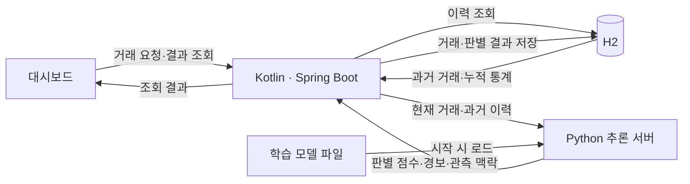

# Fraud Lab

Fraud Lab은 과거 거래 이력으로 금융 이체의 이상 징후를 판별하는 Kotlin·Spring Boot 프로젝트입니다.

Kotlin 서버는 새 거래를 받고 과거 거래 이력을 조회합니다. Python 모델은 거래와 이력을 분석해 판별 점수를 계산합니다. Kotlin 서버는 거래와 판별 결과를 H2에 저장합니다. 대시보드는 저장된 결과를 조회합니다.

판별 대상은 AI Hub 합성데이터의 정상·이상 라벨입니다. 경보는 검토가 필요한 거래를 알리는 신호입니다. 실제 사기를 확정하거나 거래의 안전을 보증하지 않습니다.

## 주요 기능

- 과거 계좌 이력을 사용하는 새 이체 판별
- 종료된 3시간 구간의 반복·분할·집중 거래 점검
- 거래 당시 입력과 판별 근거의 저장
- 저장된 거래와 판별 결과의 조회
- 동일 요청 재시도의 중복 처리 방지

카드 거래와 기존 4필드 이체 기준모델도 시연할 수 있습니다. 각 모델의 입력과 평가 결과는 별도로 관리합니다.

## 처리 구조

Kotlin과 Python은 별도 서버로 실행됩니다. 두 서버는 HTTP로 JSON 데이터를 주고받습니다.


```mermaid
flowchart LR
    UI["대시보드"] -->|거래 요청·결과 조회| API["Kotlin · Spring Boot"]
    API -->|이력 조회| DB[("H2")]
    DB -->|과거 거래·누적 통계| API
    API -->|현재 거래·과거 이력| Python["Python 추론 서버"]
    Model["학습 모델 파일"] -->|시작 시 로드| Python
    Python -->|판별 점수·경보·관측 맥락| API
    API -->|거래·판별 결과 저장| DB
    API -->|조회 결과| UI
```

새 이체는 다음 순서로 처리합니다.

1. Kotlin 서버가 입력을 검증합니다.
2. Kotlin 서버가 과거 거래와 누적 통계를 조회합니다.
3. Kotlin 서버가 현재 거래와 과거 이력을 Python에 전달합니다.
4. Python이 모델 입력 특징을 계산합니다.
5. Python 모델이 판별 점수를 계산합니다.
6. Python이 점수와 경보 기준을 비교합니다.
7. Kotlin 서버가 모델 응답을 검증합니다.
8. Kotlin 서버가 거래와 판별 결과를 함께 저장합니다.

모델 연결에 실패하면 서버는 오류를 반환합니다. Kotlin 서버는 잘못된 모델 응답도 오류로 처리합니다. 두 경우 모두 정상 판별을 만들어 저장하지 않습니다.

모델은 별도의 Python 작업으로 학습합니다. 추론 서버는 시작할 때 저장된 모델을 읽습니다. 거래 요청마다 모델을 다시 학습하지 않습니다.

## 입력

기본 이체 API는 `POST /api/bank/contextual-events`입니다. 요청에는 거래 정보 9개와 `Idempotency-Key` 헤더가 필요합니다.

```http
POST /api/bank/contextual-events
Content-Type: application/json
Idempotency-Key: demo-transfer-001
```

```json
{
  "거래일자": "20241215",
  "출금계좌일련번호": "DEMO-SENDER-01",
  "입금계좌일련번호": "DEMO-RECEIVER-01",
  "출금금융회사일련번호": "DEMO-BANK-01",
  "입금금융회사일련번호": "DEMO-BANK-02",
  "거래금액": 5000000,
  "거래시간대": 9,
  "자금구분": "0",
  "매체구분": "2"
}
```

위 요청은 가상 거래를 사용한 입력 예시입니다. 특정 점수나 경보 결과를 보장하지 않습니다.

| 입력 | 의미 |
| --- | --- |
| 거래일자 | 거래가 발생한 날짜 |
| 출금 금융회사·계좌 | 송신자의 과거 기록을 연결하는 키 |
| 입금 금융회사·계좌 | 수신 관계와 거래 흐름을 연결하는 키 |
| 거래금액 | 현재 이체 금액 |
| 거래시간대 | 3시간 구간의 시작 시각 |
| 자금구분 | 일반·급여 등 자금 종류 |
| 매체구분 | 인터넷 뱅킹 등 이체 방식 |

시간대 `9`는 09~11시 구간입니다. 자금구분 `0`은 일반입니다. 매체구분 `2`는 인터넷 뱅킹입니다.

계좌와 금융회사는 기록을 연결하는 키로 사용합니다. 식별자 문자열 자체는 모델 특징에 넣지 않습니다.

과거 통계는 서버가 계산합니다. 평균 금액이나 거래 횟수는 사용자가 직접 입력하지 않습니다. 요청에는 정답 라벨이나 사용자가 만든 과거 이력을 넣을 수 없습니다.

현재 API는 0 이상 10경 원 미만의 금액을 받습니다. 금액은 소수 둘째 자리까지 허용합니다. 모델의 관측 금액 범위 정책은 1원~5억 원입니다. 입력 허용 범위가 예측 신뢰도를 보장하지는 않습니다.

날짜·식별자·코드의 허용값은 [입력 계약](docs/bank-input-contract.md)을 확인하세요.

## 출력과 저장

| 출력 | 의미 |
| --- | --- |
| `decision.riskScore` | 모델이 계산한 0~1 판별 점수 |
| `decision.alert` | 최종 경보 여부 |
| `decision.threshold` | 판별에 사용한 경보 기준 |
| `observedContext` | 과거 거래 횟수·평균 금액·수신 관계 |
| `featureSnapshot` | 모델에 전달한 변환 후 특징 |
| `historyStatus` | 과거 이력의 유무와 검증 상태 |
| `supportAssessment` | 학습·평가 범위와의 일치 상태 |

Kotlin 서버는 거래와 판별 근거를 함께 저장합니다. 저장된 결과를 조회하면 거래 당시의 점수와 기준을 반환합니다.

같은 요청 키로 같은 본문을 다시 보내면 기존 결과를 반환합니다. 같은 요청 키로 다른 본문을 보내면 HTTP 409를 반환합니다.

새 로컬 DB에는 실제 계좌의 과거 거래가 없습니다. 이력이 부족한 거래는 판별 점수와 이력 부족 상태를 함께 확인해야 합니다.

## 모델과 판별 점수

기본 이체 모델은 `HistGradientBoostingClassifier`입니다. 연구 후보는 `XGBoost`와 정상 분포 보조 모델을 사용합니다. HGB와 XGBoost는 결정 트리 기반 머신러닝 분류기입니다.

학습 정답은 데이터셋의 `이상거래여부`입니다.

- `0`: 정상 라벨
- `1`: 이상 라벨

모델은 예측과 정답의 오차를 줄이도록 학습합니다. 새 거래를 판별할 때는 정답을 입력하지 않습니다.

기본 모델은 36개 특징을 사용합니다.

- 최근 7·30·90일 거래 횟수
- 과거 평균·최대 금액과 현재 금액의 비율
- 해당 수신자와의 과거 거래 횟수
- 과거 시간대·자금 종류·이체 방식의 비중
- 전체 과거 누적 통계
- 마지막 거래 이후의 경과일

Python은 금액과 횟수에 로그 변환을 적용합니다. 자금·매체 코드는 범주형 특징으로 처리합니다. 학습과 추론은 같은 특징 계산 모듈을 사용합니다.

기본 모델은 초기 판단값에 여러 트리의 보정값을 더합니다. 시그모이드 함수는 합산값을 0~1 점수로 변환합니다.

현재 기본 모델의 경보 기준은 약 `0.46325`입니다. 점수가 기준 이상이면 경보를 남깁니다. 이 기준은 2023년 4분기 개발 구간에서 선택했습니다. 선택 조건은 경보 비율 2% 이하에서 F1 최대화입니다.

같은 금액도 과거 이력에 따라 다른 점수가 나올 수 있습니다. 판별 점수는 실제 사기 확률로 보정한 값이 아닙니다.

## 거래 직후 판별과 구간 점검

기본 모델은 거래일 이전의 이력을 사용합니다. 같은 날짜의 거래를 서로의 과거 이력에 넣지 않습니다.

입출금 흐름 연구 경로에서는 이전 3시간 구간의 흐름도 사용합니다. 같은 구간 안의 정확한 거래 순서는 원본 데이터에서 확인할 수 없습니다.

구간 점검은 해당 3시간 구간이 끝난 뒤 실행합니다. 구간 점검 모델은 구간 전체 거래에서 추가 특징을 계산합니다.

- 거래 건수와 총액
- 금액 분산과 동액 반복
- 송신자와 수신자 수
- 역방향 이체와 입출금 집중도

구간 점검 결과는 거래 직후 판별과 구분합니다.

일반·동시 거래 전문 모델 조합은 두 점수를 따로 계산합니다. 각 모델의 점수에 해당 경보 기준을 적용합니다. 둘 중 하나가 경보를 내면 최종 경보를 남깁니다.

## 학습 데이터와 검증

AI Hub의 [「이상 판별을 위한 금융거래 정보 및 사용자 패턴 합성데이터」](https://aihub.or.kr/aihubdata/data/view.do?dataSetSn=71925)를 사용합니다.

과거 특징은 판별 시점 이전의 거래에서 계산합니다. 구간 특징은 종료된 구간의 전체 거래에서 계산합니다. 이상 유형과 설명은 판별 입력에 넣지 않습니다.

기본 모델은 학습 파티션의 2023년 3분기까지 **2,382,445건 전부**를 학습했습니다. 2023년 4분기는 모델과 경보 기준 선택에 사용했습니다.

현재 보유·검증한 2024년 이전 이체 원본은 **3,002,406건**입니다. 별도 연구에서는 이 데이터 전량으로 재학습하고 여러 시간 분할 실험을 수행했습니다. 각 시간 분할에서 해당 시점 이전의 학습 가능한 거래를 모두 사용합니다.

| 모델·평가 범위 | 평가 거래 수 | 경보 정밀도 | 재현율 | 적용 상태 |
| --- | ---: | ---: | ---: | --- |
| 기본 이체 모델 · 2024년 검증 파티션 | 159,380 | 73.66% | 62.48% | 기본 API |
| 구간 점검 일반·전문 모델 조합 · 2024년 전체 후향 평가 | 1,431,700 | 78.53% | 76.93% | 명시적으로 실행하는 연구 API |
| 114개 특징 후보 조합 · 네 과거 개발 구간 | 1,337,000 | 90.05% | 68.35% | 기본 API 미적용 |

세 결과는 평가 시점·모집단·판별 방식이 다릅니다. 단순한 성능 상승으로 비교하지 않습니다.

114개 특징 후보는 두 XGBoost 모델과 정상 분포 보조 점수를 결합했습니다. 이상 정답 4,951건 중 3,384건을 탐지했습니다. 오탐은 374건이고 미탐은 1,567건입니다. 심야 유형 23건은 모두 놓쳤습니다. 이력이 부족한 계좌의 이상 거래 15건도 모두 놓쳤습니다.

연구 목표는 다음과 같습니다.

- 경보 정밀도 90% 이상
- 재현율 80% 이상
- 관측 유형별 재현율 50% 이상
- 경보 비율 2% 이하

모든 목표를 충족한 후보는 없습니다. 이 목표는 프로젝트의 검증 기준입니다. 금융권 운영 기준으로 사용하지 않습니다.

142개 특징 후보도 네 과거 개발 구간의 학습·평가를 마쳤습니다. 정밀도는 90.04%, 재현율은 68.63%이며, 심야 유형과 이력 부족 이상 거래는 모두 놓쳤습니다. 목표를 충족하지 못해 기본 API에 적용하지 않았습니다.

## 검증 한계

2024년 결과와 과거 개발 결과를 반복 확인했습니다. 새로운 독립 미래 성능으로 주장하지 않습니다.

최신 개발 평가의 200만 원 미만 거래에는 이상 정답이 없습니다. 이 데이터로 소액 이상 탐지 성능을 평가할 수 없습니다.

원본 거래 시각은 3시간 단위입니다. 구간 내부의 정확한 거래 순서는 알 수 없습니다.

로컬 이력이 실제 계좌의 전체 이력인지 검증하지 않았습니다. 실제 금융기관의 사기 탐지 성능과 손실 감소도 검증하지 않았습니다.

인증·식별자 암호화·다중 서버 운영은 현재 구현 범위에 포함되지 않습니다.

특징 제거 실험과 유형별 결과는 [모델 검증 문서](docs/model-validation.md)를 확인하세요.

## 실행

실행에는 Python 3.14, JDK 17, Windows PowerShell이 필요합니다. 첫 실행에는 인터넷 연결이 필요합니다. 실행 스크립트가 Python 패키지와 Gradle 의존성을 내려받습니다.

1. 저장소를 복제하세요.

   ```powershell
   git clone https://github.com/sugowslt/transaction-anomaly-detection.git
   ```

2. 저장소 폴더로 이동하세요.

   ```powershell
   cd transaction-anomaly-detection
   ```

3. 실행 스크립트를 시작하세요.

   ```powershell
   python scripts\run_demo.py
   ```

   스크립트는 Python 모델 서비스와 Kotlin 서버를 실행합니다. Python 모델 서비스의 기본 주소는 `http://127.0.0.1:8001`입니다.

4. Kotlin 서버의 준비가 끝나면 대시보드를 여세요.

   `http://127.0.0.1:8080/dashboard-preview.html`

5. 실행을 종료하려면 해당 터미널에서 `Ctrl+C`를 누르세요.

입출금 흐름과 구간 점검 연구 경로가 필요하면 3단계에서 다음 명령을 사용하세요.

```powershell
python scripts\run_demo.py --experimental-bank-v2
```

이 옵션은 최신 XGBoost 후보를 기본 모델로 교체하지 않습니다.

시연에는 원본 CSV가 필요하지 않습니다. 시연 거래는 별도로 만든 가상 데이터입니다. 실제 금융기관 거래는 자동으로 수집하지 않습니다.

## 데이터와 학습 재현

저장소에는 원본 CSV와 원본에서 추출한 샘플을 포함하지 않습니다. 로컬 H2 DB도 Git에 포함하지 않습니다. 가상 시연 거래에는 정답 라벨이 없어 성능 집계에서 제외합니다.

학습 재현에는 AI Hub 이용 승인을 받은 원본 CSV와 가상환경이 필요합니다. 데모 실행 스크립트는 첫 실행에 가상환경을 만듭니다.

1. 학습 파티션의 CSV를 `data/training/<분류>/`에 넣으세요.
2. 검증 파티션의 CSV를 `data/validation/<분류>/`에 넣으세요.
3. 가상환경이 준비되면 기본 이체 학습을 실행하세요.

   ```powershell
   .\.venv\Scripts\python.exe scripts\train_bank_contextual.py
   ```

학습 명령은 해당 모델과 보고서를 다시 생성합니다.

## 관련 문서

- [입력 계약](docs/bank-input-contract.md)
- [모델 학습·검증과 한계](docs/model-validation.md)
- [시연 가이드](docs/demo-guide.md)
- [문제 해결 기록](docs/troubleshooting.md)
- [카드 기준모델 보고서](reports/card_baseline.json)
- [이체 기준모델 보고서](reports/bank_baseline.json)
